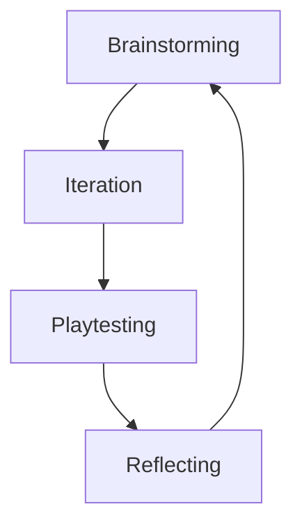

#star/creation

an Idea originally from Jesse Schell Game Design

Basically, try to develop a loop of [[iteration]]:

Basically do this AS OFTEN and as QUICKLY as POSSIBLE

It's REALLY TRUE that the longer you spend on any particular cycle of the loop the HARDER it gets to incorporate feedback and changes. It's really easy to get stuck on something when you spend a long time iterating it and then finish the iteration, feel like there's a lot to fix and then think about having to fix it.  ^twd3en

[[Avoid the Trap of the Too Polished Prototype]]